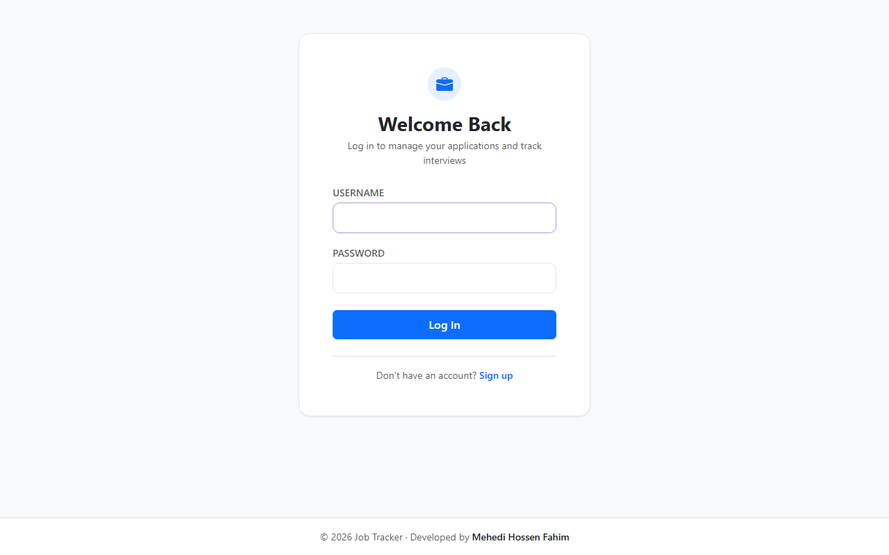
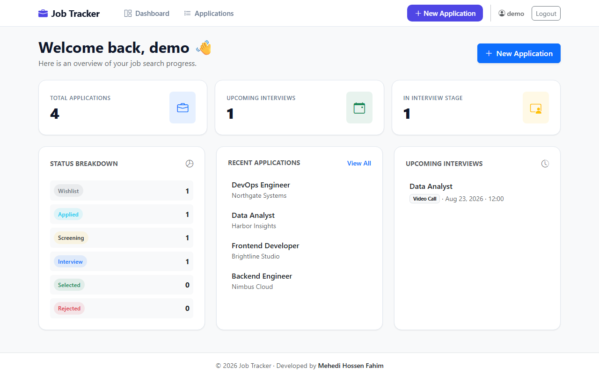
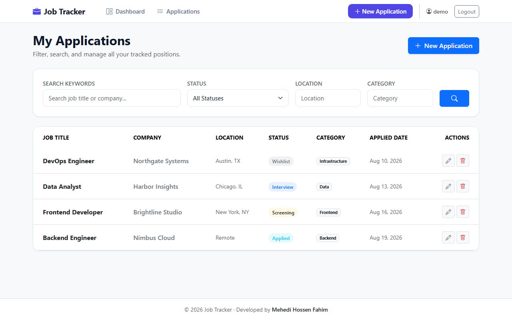
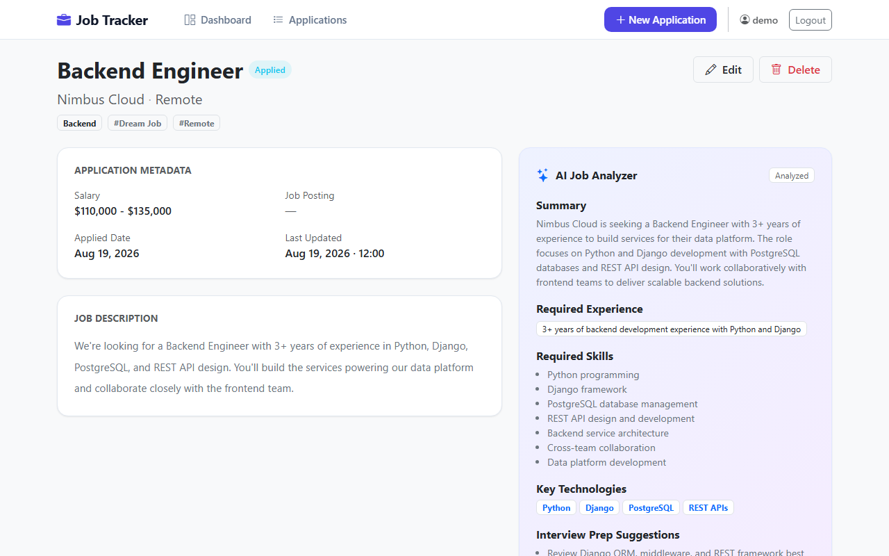
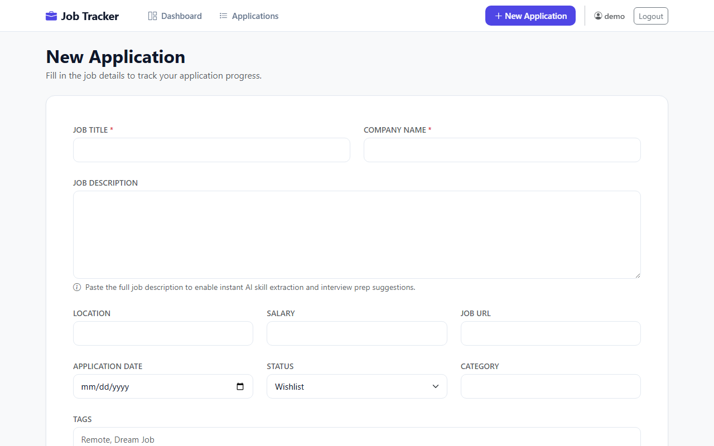

# Job Application Tracker (with Claude AI Integration)

A lightweight Django web app to organize your job search, manage interview schedules, and analyze job descriptions using Claude.

## Overview

Applying for jobs gets messy fast. This tool keeps everything in one place—tracking your application pipeline, logging interview rounds, and breaking down long job listings into actionable summary points using the Anthropic API.

## Screenshots

<div align="center">

|                                                              Authentication                                                               |                                                                                      Dashboard                                                                                       |
| :---------------------------------------------------------------------------------------------------------------------------------------: | :----------------------------------------------------------------------------------------------------------------------------------------------------------------------------------: |
| <br><sub>_Clean login interface for authenticated user sessions._</sub> | <br><sub>_Central hub showing active pipeline metrics, total applications, and upcoming interview dates._</sub> |

|                                                                                   Application List                                                                                   |                                                                                Application Details & AI Insights                                                                                |
| :----------------------------------------------------------------------------------------------------------------------------------------------------------------------------------: | :---------------------------------------------------------------------------------------------------------------------------------------------------------------------------------------------: |
| <br><sub>_Filterable list view allowing quick searches by status, company, title, or tags._</sub> | <br><sub>_Detailed application view, including interview logs and structured Claude AI insights._</sub> |

</div>

<br>

<div align="center">

|                                                                                           Adding / Editing Applications                                                                                           |
| :---------------------------------------------------------------------------------------------------------------------------------------------------------------------------------------------------------------: |
| <br><sub>_Form input interface to create or update target company details, salary, location, and full job descriptions._</sub> |

</div>

## Video Demo

Click the preview image below to watch the full walkthrough on Google Drive:

## [](https://drive.google.com/file/d/1yrUAFleGMep7ciem8bF79zTVbx_zkuRv/view?usp=sharing)

## Features

- **User Accounts:** Registration, login, and isolated user data (each user only sees their own applications).
- **Application Pipeline:** Track jobs across status stages (`Wishlist` → `Applied` → `Screening` → `Interview` → `Selected / Rejected`).
- **Interview Tracking:** Log multiple interview rounds per company with stage type (HR, Technical, Onsite), time, meeting links, and preparation notes.
- **Search & Filters:** Instant filtering by application status, tag, location, or target company.
- **AI Job Analyzer:** Sends raw job descriptions to the Anthropic API to parse out:
  - Concise role summary
  - Core skills & key tech stack required
  - Expected experience level
  - Tailored interview prep suggestions
- **Dashboard Metrics:** Visual counters for active applications, upcoming interview schedules, and recent updates.

## Tech Stack

- **Backend:** Python 3.12, Django 5.1
- **Database:** SQLite (default development DB)
- **Frontend:** Server-rendered HTML templates with Bootstrap 5
- **Integrations:** Anthropic API (via standard `requests` calls)

## Project Structure

```text
config/         Django configuration files (settings, root URLs, WSGI/ASGI)
accounts/       User authentication views, login forms, and registration logic
tracker/        Core application logic
  ├── ai_service.py   Anthropic API calls & response parsing
  ├── models.py       Database schemas (Application, Interview, Tag, AIAnalysis)
  └── views.py        Views for application CRUD and dashboard views
templates/      Base templates and app-specific layouts
static/         Custom CSS stylesheets
screenshots/    UI screenshots for documentation

```

## Setup Instructions

### 1. Clone the repository and navigate into the folder

```bash
git clone https://github.com/MehdiHossenFahim/job-tracker-ai-analyzer.git
cd job-tracker-ai-analyzer

```

### 2. Set up a virtual environment

```bash
python3 -m venv venv
source venv/bin/activate  # On Windows: venv\Scripts\activate

```

### 3. Install requirements

```bash
pip install -r requirements.txt

```

### 4. Configure environment variables

Create a `.env` file in the root directory:

```bash
cp .env.example .env

```

Add your environment values inside `.env`:

```env
DJANGO_SECRET_KEY=your_secret_key_here
ANTHROPIC_API_KEY=your_anthropic_api_key_here

```

> **Note:** `ANTHROPIC_API_KEY` is only required if you intend to run the AI analyzer feature. The rest of the application runs completely fine without it.

### 5. Run database migrations

```bash
python manage.py makemigrations
python manage.py migrate

```

### 6. (Optional) Seed sample demo data

If you want mock applications and upcoming interviews pre-populated:

```bash
python manage.py seed_demo_data --username demo --password demopass123

```

### 7. Run the dev server

```bash
python manage.py runserver

```

Open `http://127.0.0.1:8000/` in your browser.

## How the AI Analyzer Works

1. Create a job application entry and paste the job listing content into the **Job Description** area.
2. Navigate to the detail view of that application and click **Run AI Analysis**.
3. The app posts the text to Claude, parses the JSON payload, and renders key takeaways right in your application panel.

If no API key is provided in your `.env` file, the app gracefully alerts you without breaking standard application functionality.

## Author

Mehedi Hossen Fahim
